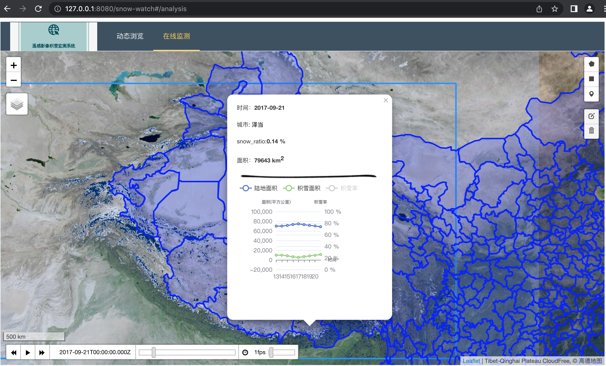
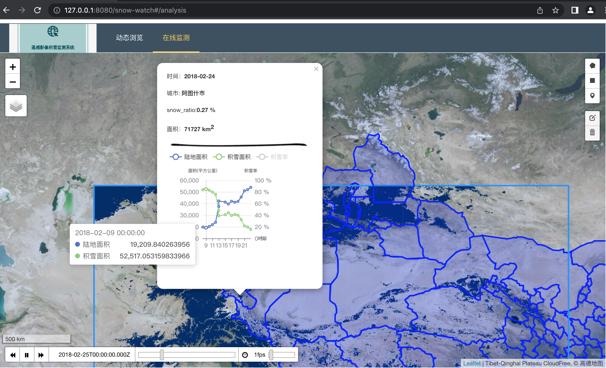

<!--
 * @Date: 2022-04-18 00:52:06
 * @LastEditors: LIULIJING
 * @LastEditTime: 2022-12-05 18:19:33
-->
# covid-19-dashboard

[](https://github.com/zy6p/covid-19-dashboard/actions/workflows/npmbuild.yml)

A vue3, echarts and leaflet covid-19 dashboard.  

## GIS 毕业设计系统实现前端代码——积雪动态监测，用Leaflet插件库TimeDimension实现了图层的动态时间轴

## ScreenShot





## Roadmap

**Front end**:
Leaflet for base map, ECharts for data visualization, and build with Vue3.    
前端使用 Vue3 框架，搭配 Leaflet 地图可视化，加上 ECharts 数据可视化。

**Back end**:
Geoserver for gis rest api, python for data collection and clear.    
后端使用 GeoServer 作为地图发布平台，python 爬虫爬取疫情数据。

## Project setup

```
npm install
```

### Compiles and hot-reloads for development

```
npm run serve
```

### Compiles and minifies for production

```
npm run build
```

### Lints and fixes files

```
npm run lint
```

### Customize configuration

See [Configuration Reference](https://cli.vuejs.org/config/).
